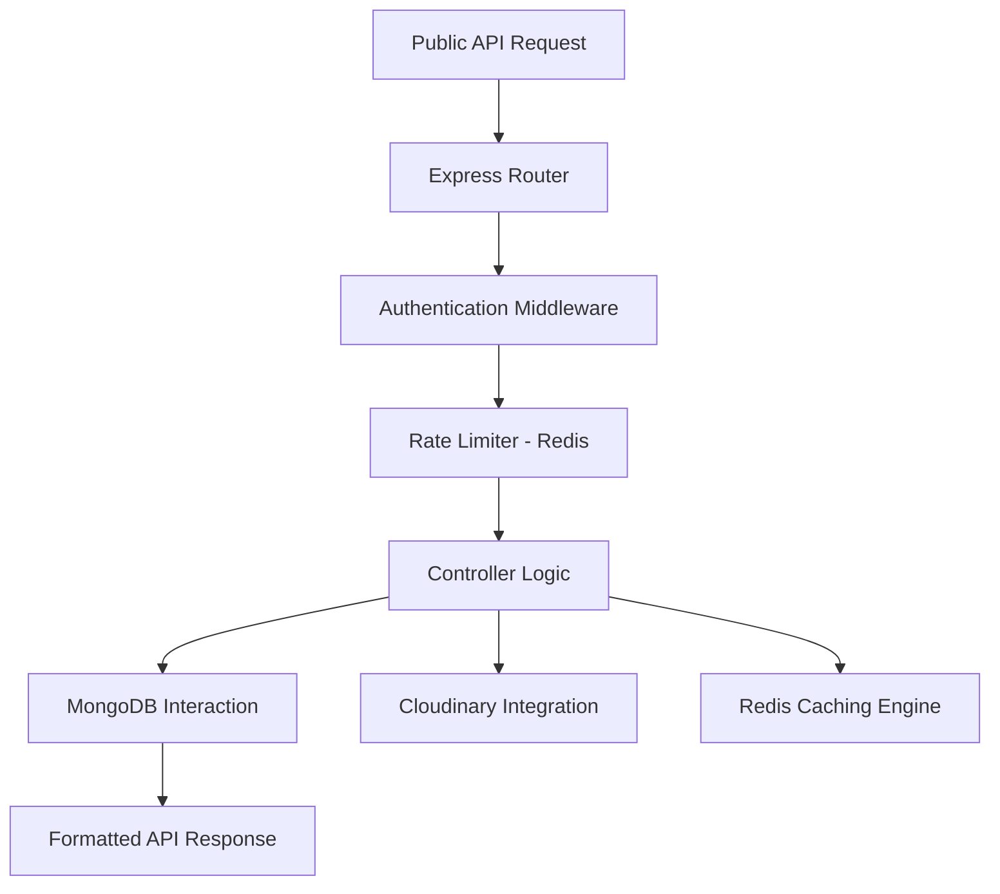

# VidVore Backend API

VidVore is a high-performance backend architecture designed for a scalable video-sharing platform. It implements critical system components including JWT-based identity management, Redis-based rate limiting, and automated cloud-media synchronization.


## Overview

The VidVore backend serves as a robust foundation for building large-scale media applications. It addresses key technical requirements such as secure user authentication, optimized data persistence with Mongoose, and sub-millisecond data retrieval using Redis.

---

## Technical Stack

| Category | Technology | Implementation Details |
| :--- | :--- | :--- |
| **Runtime** | Node.js | Asynchronous, event-driven module system (ESM) |
| **Web Server** | Express.js | Modular routing and centralized middleware management |
| **Primary Database**| MongoDB | Schema validation and aggregation pipelines via Mongoose |
| **Caching/Limiting**| Redis | Session-level caching and global rate limiting |
| **Media Engine** | Cloudinary | Auto-transformation and CDN-based delivery |
| **Containerization**| Docker | Standardized deployment through Docker Compose |

---

## System Architecture

The project follows a decoupling strategy, separating state persistence from business operations.


### Request Lifecycle



---

## Core Engineering Features

### Authentication and Identity Management
- Implements a Dual-Token (Access/Refresh) strategy for enhanced security.
- Cryptographic password hashing using standard Bcrypt algorithms.
- Middleware-driven authorization for granular route protection.

### Performance and Security
- **Global Rate Limiting:** Enforced via Redis to prevent brute-force attacks.
- **Data Caching:** Frequently accessed metadata is cached in Redis to reduce database load.
- **Centralized Error Handling:** Standardized error response objects for API consistency.

### Media Workflow
- Automated cleanup of local disk storage post-Cloudinary synchronization.
- Support for multi-part form data processing via Multer.
- Real-time video/image processing and optimization during ingestion.

---

## API Endpoints Overview

| Module | Base Path | Key Functionality |
| :--- | :--- | :--- |
| **Identity** | `/api/v1/users` | Registration, Authenticated Profile, Token Rotation |
| **Media** | `/api/v1/videos` | Video CRUD, Search Pipelines, Metadata updates |
| **Interactions** | `/api/v1/likes` | Optimized interaction toggling |
| **Analytics** | `/api/v1/dashboard` | Aggregated user performance metrics |
| **Documentation** | `/api-docs` | Interactive Swagger/OpenAPI specifications |

---

## Deployment and Local Setup

### Prerequisites
- Node.js (Version 18.0 or higher)
- Docker Desktop
- MongoDB Atlas or Local Instance
- Redis Instance

### Local Execution (Docker)
Ensure Docker is running and execute:
```bash
docker-compose up --build chalwao
```

### Manual Configuration
1. Initialize environment: `cp .env.example .env`
2. Configure credentials for MongoDB, Redis, and Cloudinary.
3. Install dependencies: `npm install`
4. Run development environment: `npm run dev`

---

## Author
**Shivansh Rajput**
Full Stack Systems Engineer
