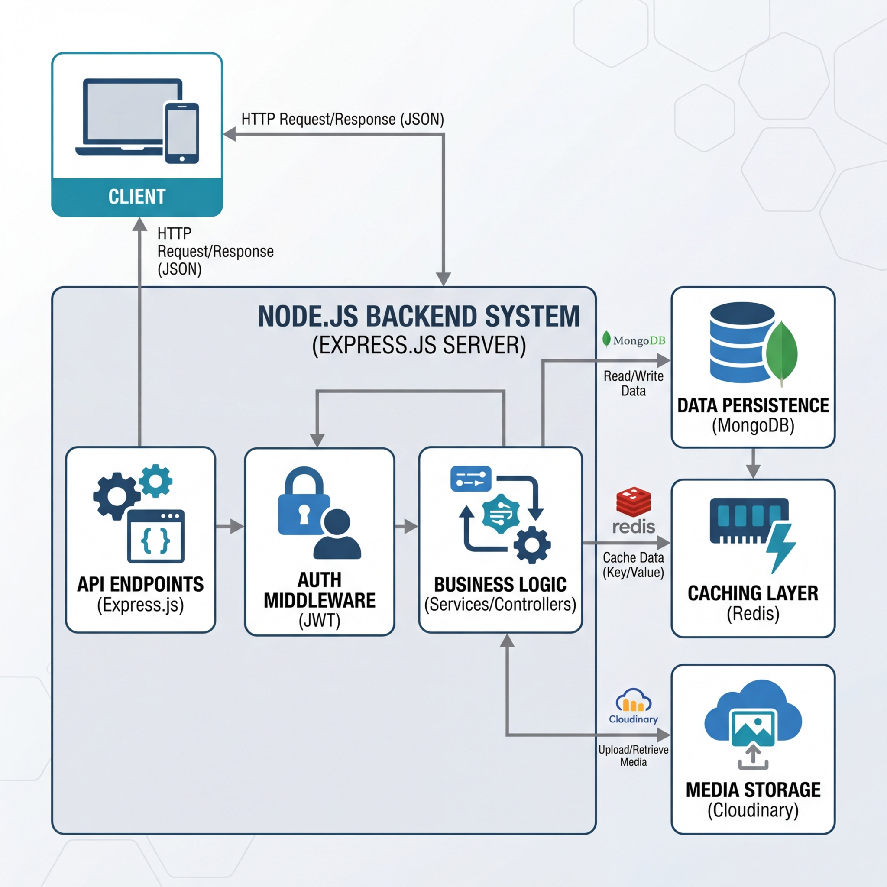
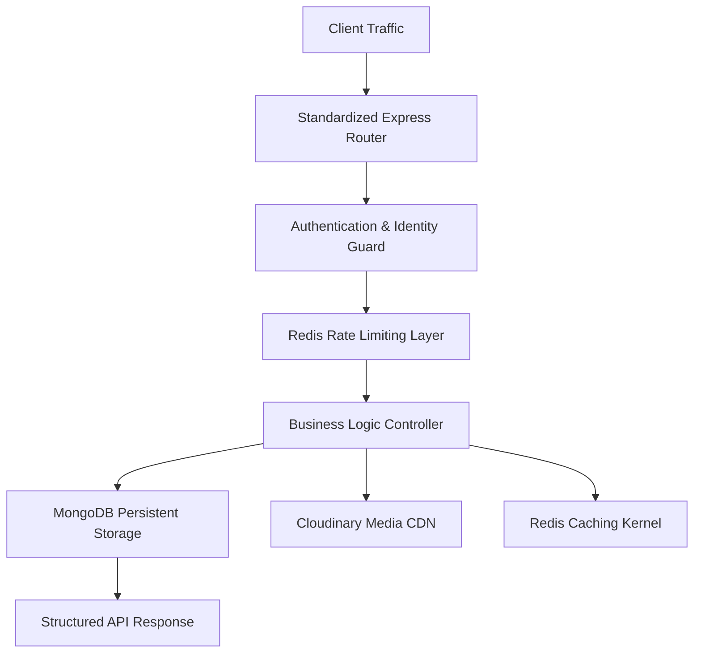

# VidVore Backend Infrastructure

[](https://github.com/Flamekaiser17/VidCore-/actions/workflows/node.js.yml)

VidVore is a high-availability backend system designed for large-scale video-centric ecosystems. It implements enterprise-grade components including multi-token authentication, Redis-based transaction limiting, and asynchronous cloud media synchronization.

---

## Technical Architecture Overview

The VidVore platform is engineered for scalability and maintains a clear separation between data persistence, business logic, and external service integrations.

### System Workflow


#### Decoupled Service Design


---

## Engineering Standards

| Dimension | Implementation Strategy |
| :--- | :--- |
| **Authentication** | Dual-Token (Access/Refresh) strategy with Bcrypt-hashing and automated rotation. |
| **Storage** | Multer-based localized ingestion with automated Cloudinary mirroring and async cleanup. |
| **Performance** | Sub-millisecond data retrieval using Redis and MongoDB aggregation pipelines. |
| **Security** | Standardized middleware for Rate Limiting, Cross-Origin Resource Sharing (CORS), and standardized error handling. |
| **Development** | ESM-based Node.js runtime with Prettier-driven codebase consistency. |

---

## Core API Infrastructure

### Identity and Profile Management
- **Registration Hub:** Orchestrates user registration with concurrent media upload processing.
- **Session Security:** Implements secure logout protocols and server-side session invalidation.
- **Dynamic Profiles:** Supports real-time updates for avatars and cover images with Cloudinary syncing.

### Content and Interaction Engine
- **Video Orchestration:** Supports creation, retrieval, updates, and deletion (CRUD) with automated metadata extraction.
- **Engagement Analytics:** Optimized interaction tracking for likes, subscriptions, and comment threading.
- **System Dashboard:** Provides aggregated channel performance statistics and historical data visualization.

---

## Deployment and Setup

### External Dependencies
- **Runtime:** Node.js (v18.0+)
- **Storage:** MongoDB & Cloudinary Account
- **Caching:** Redis Instance
- **Environment:** Docker Desktop

### Standardized Execution (Containerized)
The entire infrastructure can be instantiated using Docker Compose to ensure environment parity:
```bash
docker-compose up --build chalwao
```

### Manual Configuration
1. Initialize variables: `cp .env.example .env`
2. Update `.env` with validated repository credentials.
3. Install dependencies: `npm install`
4. Execute development server: `npm run dev`

---

## Quality Assurance

VidVore includes an automated CI/CD pipeline via GitHub Actions. Every commit undergoes:
1. **Linter validation:** Ensuring adherence to formatting standards.
2. **Connectivity validation:** Verifying integration points between Node.js, MongoDB, and Redis.

### Run Local Tests
```bash
npm test
```

---

## Author
**Shivansh Rajput**
Full Stack Systems Engineer
Specializing in Distributed Systems & Scalable Architectures
